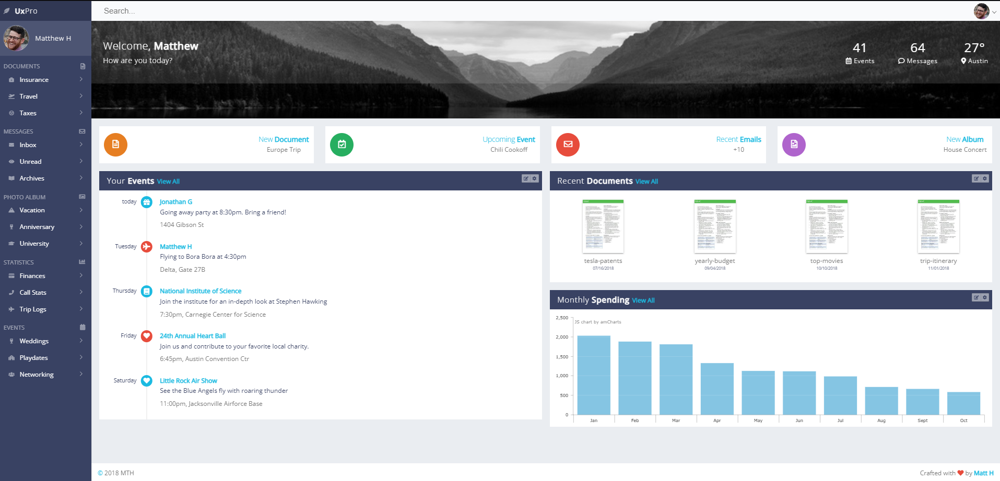

# Assessment Mobile First UI com React, Bloco 3 DR1, 10.04.2023

## Alberto Fontenelle Pluecker

## Prof. Jonh Carvalho

## [Exercício 1](https://replit.com/@INFNET-GRLEDC01C1-N2-L1/MFUIR-AT-01-AlbertoFontenel)

### Dashboard Pessoal

--

> O seu objetivo neste trabalho é implementar um dashboard, que pode ter vários tipos de uso. No nosso caso usado para administrar eventos, documentos, emails, gastos, álbuns etc. Busque implementar com o layout parecido para cada componente conforme a imagem abaixo mas não precisa das mesma propriedades de cores, bordas, etc.

**Esta página deve conter:**

- Usando componente com css externo. Aplicar ao \[main-header\]

- Usando componente com css inline. Aplicar ao \[sidenav\]

- Usando componente com CSS Modules. Aplicar ao \[main-overview e overview-card\]

- Usando componente com Styled Component. \[Main-Cards e Card\]

**IMPORTANTE**:

- A página tem que estar responsiva.

- Em telas pequenas, deve-se ter apenas uma coluna e retirar o que não for relevante e esconder o menu.

- A página deve ser toda componentizada.

- Não pode haver o uso de bibliotecas CSS(MUI, bootstrap, etc.).

**Observações adicionais do Prof.:**

> Trabalhamos em sala e no TP3 nesse dashboard, porém agora você tem uma outra condição: os elementos da sua página, quando possível e útil, devem ser componentes React e todos os elementos que se repetem na mesma, como a relação de amigos, devem ser criados pela reutilização de um componente.
